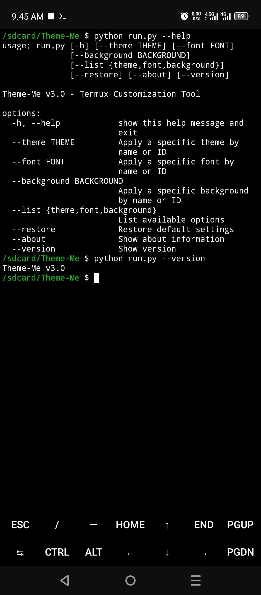

<div align="center">
  
</div>

<div align="center">

[](https://github.com/zidan-idz)
[-%23FF0000?style=for-the-badge)](https://github.com/zidan-idz/Theme-Me/releases)
[](https://www.python.org/)
[](https://termux.com/)

</div>

---

## 📖 Description
**Theme-Me** is a simple customization tool designed specifically for **Termux**. It allows you to completely transform your terminal's appearance with custom themes, fonts, and color schemes (backgrounds).

### ✨ Features
*   🎨 **20+ Unique Themes** - each with custom ASCII art and personalized username/team display
*   🔤 **20+ Professional Fonts** - enhance your terminal readability
*   🌈 **20+ Color Schemes** - from dark modes to vibrant palettes
*   🧭 **Dual Mode** - interactive menu & CLI arguments
*   👤 **Personalization** - custom username and team name on login
*   ♻️ **Restore Defaults** - revert Termux back to its original look
*   🔄 **Update Tool** - check and apply the latest updates
*   ⚡ **Offline Support** - works fully offline after initial setup


---

## 📦 Installation
```bash
# Update packages
pkg update && pkg upgrade -y

# Install Git and Python
pkg install git python -y

# Clone the repository
git clone https://github.com/zidan-idz/Theme-Me

# Enter directory
cd Theme-Me

# Run installation
bash install.sh
```

---

## 🖥️ Interactive Mode
To enter the interactive menu:
```bash
# Start the tool with Interactive Mode
python run.py
```

### Menu Options
1. **Change Theme** - Browse and apply custom ASCII art themes
2. **Change Font** - Select from professional monospace fonts
3. **Change Background** - Apply color schemes
4. **Restore Defaults** - Reset to original Termux settings
5. **Report Issue** - Open GitHub issues page
6. **Update Tool** - Check for updates
7. **About** - View tool information
8. **Exit** - Close the application

### How to Apply a Theme
1. Select option `1` (Change Theme)
2. Browse the list of available themes with their IDs
3. Enter the theme ID (e.g., `infernal-reaper` or `blacklist`)
4. Enter your **username** when prompted
5. Enter your **team name** when prompted
6. Wait for confirmation message
7. Open new Termux session or restart Termux to see your theme!

> 💡 **Tip**: The same process applies to fonts and backgrounds - just select the menu option, choose an ID, and confirm!

---

## ⚡ CLI Mode (Command Line Interface)
For advanced users, **Theme-Me** supports command-line arguments for quick actions.

### Available Commands

| Argument | Description | Example |
| :--- | :--- | :--- |
| `--theme <name/id>` | Apply a specific theme | `python run.py --theme "infernal-reaper"` |
| `--font <name/id>` | Apply a specific font | `python run.py --font "meslo"` |
| `--background <name/id>` | Apply a specific background | `python run.py --background "dracula"` |
| `--list <type>` | List available options | `python run.py --list theme` |
| `--restore` | Restore default settings | `python run.py --restore` |
| `--about` | Show about information | `python run.py --about` |
| `--version` | Show version information | `python run.py --version` |

### CLI Examples
```bash
# Apply a theme (will prompt for username/team)
python run.py --theme "infernal-reaper"

# List all available themes
python run.py --list theme

# List all available fonts
python run.py --list font

# Apply a font
python run.py --font "hack"

# Apply a background color scheme
python run.py --background "default-dark"

# Restore to default Termux settings
python run.py --restore
```

> 📝 **Note**: When applying themes via CLI, you'll still be prompted to enter your username and team name for personalization.

---

## 📸 Screenshots
<div align="center">
  
  
</div>

---

## ⚠️ Disclaimer
This tool modifies Termux configuration files. While it includes a restore feature, please use at your own risk. The author is not responsible for any data loss or system issues that may occur from using this tool

**Recommendations:**
- Backup your Termux configuration before using this tool
- Test on a non-critical Termux installation first
- Use the "Restore Defaults" feature if you encounter any issues
- Ensure you have an **internet connection** if you are missing local resource files (they will be downloaded automatically)

---

## 📝 Changelog

See [CHANGELOG.md](CHANGELOG.md) for detailed version history.

---

## 📄 License
This project is licensed under the **MIT License** - see the [LICENSE](LICENSE) file for details.

---
